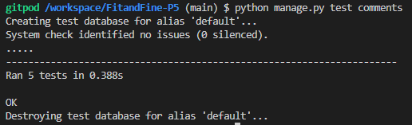

# Fit&Fine DRF API Testing

## Table of contents

- [Fit\&Fine DRF API Testing](#fitfine-drf-api-testing)
  - [Table of contents](#table-of-contents)
  - [Manual Testing](#manual-testing)
    - [Authentication Endpoints](#authentication-endpoints)
    - [Profile Endpoints](#profile-endpoints)
    - [Post Endpoints](#post-endpoints)
    - [Comment Endpoints](#comment-endpoints)
    - [Daily Routine Endpoints](#daily-routine-endpoints)
    - [Challenge Endpoints](#challenge-endpoints)
    - [Collaborate Endpoints](#collaborate-endpoints)
    - [Like Endpoints](#like-endpoints)
    - [Follower Endpoints](#follower-endpoints)
  - [Automated Testing](#automated-testing)
    - [Challenge Model Tests](#challenge-model-tests)
    - [Collaborate Model Tests](#collaborate-model-tests)
    - [Comment Model Tests](#comment-model-tests)
    - [Daily Routine Model Tests](#daily-routine-model-tests)
    - [Followers Model Tests](#followers-model-tests)
    - [Like Model Tests](#like-model-tests)
    - [Post API Tests](#post-api-tests)
    - [Profile Model Tests](#profile-model-tests)
    - [Running the Tests](#running-the-tests)

##  Manual Testing

A series of manual tests were devised for each endpoint. The test data set included various users with different roles (admin, user). The API and front-end application were tested to ensure that they function as expected. Users should be able to access their own data, while admin users should have additional privileges, such as creating and editing user profiles, posts, comments, daily routines, challenges, and contacts. All users should be able to create events but only interact with their own posts and comments.

Tests were performed using the Django Rest Framework HTML interface running on a test server.

### Authentication Endpoints

| Endpoint                 | Method | CRUD Operation | Description                                      | Expected Result                  | Actual Result | Pass/Fail |
|--------------------------|--------|----------------|--------------------------------------------------|----------------------------------|---------------|-----------|
| `/dj-rest-auth/login/`   | POST   | Create         | Log in a user and obtain authentication tokens   | User logged in, tokens returned  | User logged in, tokens returned | PASS       |
| `/dj-rest-auth/logout/`  | POST   | Delete         | Log out a user and invalidate tokens             | User logged out, tokens invalidated | User logged out, tokens invalidated | PASS       |
| `/dj-rest-auth/registration/` | POST | Create      | Register a new user                              | User registered, details returned | User registered, details returned | PASS       |

### Profile Endpoints

| Endpoint                | Method | CRUD Operation | Description                               | Expected Result                          | Actual Result | Pass/Fail |
|-------------------------|--------|----------------|-------------------------------------------|------------------------------------------|---------------|-----------|
| `/profiles/`            | GET    | Read           | Retrieve a list of profiles               | List of profiles returned                | List of profiles returned | PASS       |
| `/profiles/`            | POST   | Create         | Create a new profile (admin only)         | Profile created, details returned        | Profile created, details returned | PASS       |
| `/profiles/<id>/`       | GET    | Read           | Retrieve a specific profile by ID         | Profile details returned                 | Profile details returned | PASS       |
| `/profiles/<id>/`       | PUT    | Update         | Update a specific profile by ID           | Profile updated, updated details returned | Profile updated, updated details returned | PASS       |
| `/profiles/<id>/`       | PATCH  | Update         | Partially update a specific profile by ID | Profile partially updated, updated details returned | Profile partially updated, updated details returned | PASS       |
| `/profiles/<id>/`       | DELETE | Delete         | Delete a specific profile by ID (admin only) | Profile deleted                          | Profile deleted | PASS       |

### Post Endpoints

| Endpoint             | Method | CRUD Operation | Description                          | Expected Result                         | Actual Result | Pass/Fail |
|----------------------|--------|----------------|--------------------------------------|-----------------------------------------|---------------|-----------|
| `/posts/`            | GET    | Read           | Retrieve a list of posts             | List of posts returned                  | List of posts returned | PASS       |
| `/posts/`            | POST   | Create         | Create a new post                    | Post created, details returned          | Post created, details returned | PASS       |
| `/posts/<id>/`       | GET    | Read           | Retrieve a specific post by ID       | Post details returned                   | Post details returned | PASS       |
| `/posts/<id>/`       | PUT    | Update         | Update a specific post by ID         | Post updated, updated details returned  | Post updated, updated details returned | PASS       |
| `/posts/<id>/`       | PATCH  | Update         | Partially update a specific post by ID | Post partially updated, updated details returned | Post partially updated, updated details returned | PASS       |
| `/posts/<id>/`       | DELETE | Delete         | Delete a specific post by ID         | Post deleted                            | Post deleted | PASS       |

### Comment Endpoints

| Endpoint              | Method | CRUD Operation | Description                             | Expected Result                          | Actual Result | Pass/Fail |
|-----------------------|--------|----------------|-----------------------------------------|------------------------------------------|---------------|-----------|
| `/comments/`          | GET    | Read           | Retrieve a list of comments             | List of comments returned                | List of comments returned | PASS       |
| `/comments/`          | POST   | Create         | Create a new comment                    | Comment created, details returned        | Comment created, details returned | PASS       |
| `/comments/<id>/`     | GET    | Read           | Retrieve a specific comment by ID       | Comment details returned                 | Comment details returned | PASS       |
| `/comments/<id>/`     | PUT    | Update         | Update a specific comment by ID         | Comment updated, updated details returned | Comment updated, updated details returned | PASS       |
| `/comments/<id>/`     | PATCH  | Update         | Partially update a specific comment by ID | Comment partially updated, updated details returned | Comment partially updated, updated details returned | PASS       |
| `/comments/<id>/`     | DELETE | Delete         | Delete a specific comment by ID         | Comment deleted                          | Comment deleted | PASS       |

### Daily Routine Endpoints

| Endpoint                   | Method | CRUD Operation | Description                               | Expected Result                          | Actual Result | Pass/Fail |
|----------------------------|--------|----------------|-------------------------------------------|------------------------------------------|---------------|-----------|
| `/dailyroutines/`          | GET    | Read           | Retrieve a list of daily routines         | List of daily routines returned          | List of daily routines returned | PASS       |
| `/dailyroutines/`          | POST   | Create         | Create a new daily routine                | Daily routine created, details returned  | Daily routine created, details returned | PASS       |
| `/dailyroutines/<id>/`     | GET    | Read           | Retrieve a specific daily routine by ID   | Daily routine details returned           | Daily routine details returned | PASS       |
| `/dailyroutines/<id>/`     | PUT    | Update         | Update a specific daily routine by ID     | Daily routine updated, updated details returned | Daily routine updated, updated details returned | PASS       |
| `/dailyroutines/<id>/`     | PATCH  | Update         | Partially update a specific daily routine by ID | Daily routine partially updated, updated details returned | Daily routine partially updated, updated details returned | PASS       |
| `/dailyroutines/<id>/`     | DELETE | Delete         | Delete a specific daily routine by ID     | Daily routine deleted                    | Daily routine deleted | PASS       |

### Challenge Endpoints

| Endpoint                  | Method | CRUD Operation | Description                              | Expected Result                          | Actual Result | Pass/Fail |
|---------------------------|--------|----------------|------------------------------------------|------------------------------------------|---------------|-----------|
| `/challenges/`            | GET    | Read           | Retrieve a list of challenges            | List of challenges returned              | List of challenges returned | PASS       |
| `/challenges/`            | POST   | Create         | Create a new challenge                   | Challenge created, details returned      | Challenge created, details returned | PASS       |
| `/challenges/<id>/`       | GET    | Read           | Retrieve a specific challenge by ID      | Challenge details returned               | Challenge details returned | PASS       |
| `/challenges/<id>/`       | PUT    | Update         | Update a specific challenge by ID        | Challenge updated, updated details returned | Challenge updated, updated details returned | PASS       |
| `/challenges/<id>/`       | PATCH  | Update         | Partially update a specific challenge by ID | Challenge partially updated, updated details returned | Challenge partially updated, updated details returned | PASS       |
| `/challenges/<id>/`       | DELETE | Delete         | Delete a specific challenge by ID        | Challenge deleted                        | Challenge deleted | PASS       |
| `/challenges/<id>/join/`  | POST   | Create         | Join a specific challenge                | Joined challenge                         | Joined challenge | PASS       |
| `/challenges/<id>/leave/` | POST   | Create         | Leave a specific challenge               | Left challenge                           | Left challenge | PASS       |

### Collaborate Endpoints

| Endpoint                    | Method | CRUD Operation | Description                                  | Expected Result                           | Actual Result | Pass/Fail |
|-----------------------------|--------|----------------|----------------------------------------------|-------------------------------------------|---------------|-----------|
| `/collaborate/`             | GET    | Read           | Retrieve a list of collaboration messages    | List of collaboration messages returned   | List of collaboration messages returned | PASS       |
| `/collaborate/`             | POST   | Create         | Create a new collaboration message           | Collaboration message created, details returned | Collaboration message created, details returned | PASS       |
| `/collaborate/<id>/`        | GET    | Read           | Retrieve a specific collaboration message by ID | Collaboration message details returned    | Collaboration message details returned | PASS       |
| `/collaborate/<id>/`        | DELETE | Delete         | Delete a specific collaboration message by ID | Collaboration message deleted             | Collaboration message deleted | PASS       |

### Like Endpoints

| Endpoint             | Method | CRUD Operation | Description                           | Expected Result                     | Actual Result | Pass/Fail |
|----------------------|--------|----------------|---------------------------------------|-------------------------------------|---------------|-----------|
| `/likes/`            | GET    | Read           | Retrieve a list of likes              | List of likes returned              | List of likes returned | PASS       |
| `/likes/`            | POST   | Create         | Create a new like                     | Like created, details returned      | Like created, details returned | PASS       |
| `/likes/<id>/`       | DELETE | Delete         | Delete a specific like by ID          | Like deleted                        | Like deleted | PASS       |

### Follower Endpoints

| Endpoint               | Method | CRUD Operation | Description                          | Expected Result                     | Actual Result | Pass/Fail |
|------------------------|--------|----------------|--------------------------------------|-------------------------------------|---------------|-----------|
| `/followers/` | GET    | Read           | Retrieve a list of followers         | List of followers returned          | List of followers returned | PASS       |
| `/followers/`          | POST   | Create         | Follow a user                        | Follow successful                   | Follow successful | PASS       |
| `/followers/<id>/`     | DELETE | Delete         | Unfollow a user by ID                | Unfollow successful                 | Unfollow successful | PASS       |

This table provides a clear overview of the API endpoints tested, including their HTTP methods, descriptions, CRUD operations, expected and actual results, and whether the test passed or failed.

## Automated Testing 

This provides an overview of the automated tests implemented for the Fit and Fine project. These tests ensure the reliability and correctness of various functionalities, including user authentication, model validations, and API endpoints.

### Challenge Model Tests

**File:** `/workspace/FitandFine-P5/challenges/tests.py`

**Description:** Tests for the Challenge model, ensuring that challenges are created, associated with users, and can be updated correctly.

**Tests:**
- **Challenge Creation:** Verifies that a challenge can be created.
- **User Association:** Ensures a challenge is associated with the correct user.
- **Default Field Values:** Checks the default values for challenge fields.
- **Retrieve by User:** Tests if a challenge can be retrieved by the associated user.
- **Update Fields:** Verifies that challenge fields can be updated correctly.


### Collaborate Model Tests

**File:** `/workspace/FitandFine-P5/collaborate/tests.py`

**Description:** Tests for the About and Collaborate models, ensuring they can be created and updated correctly.

**Tests:**
- **About Creation:** Verifies that an About entry can be created.
- **About Update:** Checks that the About entry can be updated.
- **Collaborate Creation:** Ensures a Collaborate entry can be created.
- **Collaborate Field Values:** Validates the fields of the Collaborate model.


### Comment Model Tests

**File:** `/workspace/FitandFine-P5/comments/tests.py`

**Description:** Tests for the Comment model, ensuring that comments are correctly associated with users and posts.

**Tests:**
- **Comment Creation:** Verifies that a comment can be created.
- **User Association:** Ensures a comment is associated with the correct user.
- **Post Association:** Checks that a comment is associated with the correct post.
- **Comment Content:** Validates the content of the comment.
- **Comment Ordering:** Ensures comments are ordered correctly.



### Daily Routine Model Tests

**File:** `/workspace/FitandFine-P5/dailyroutines/tests.py`

**Description:** Tests for the Daily Routine model, ensuring routines are valid and realistic.

**Tests:**
- **Routine Creation:** Verifies that a daily routine can be created.
- **Date Validation:** Ensures the date is not set in the future.
- **Update Mood:** Tests updating the mood of a routine.
- **Profile Link:** Ensures routines link to the user's profile.
- **Water Intake Validation:** Checks for realistic water intake values.
- **Default Junk Food Setting:** Verifies the default setting for junk food consumption.


### Followers Model Tests

**File:** `/workspace/FitandFine-P5/followers/tests.py`

**Description:** Tests for the Follower model, ensuring follower relationships are managed correctly.

**Tests:**
- **Follower Creation:** Verifies that a follower relationship can be created.
- **Owner Association:** Ensures a follower is associated with the correct owner.
- **Followed Association:** Checks that a follower is associated with the correct followed user.
- **Unique Follower:** Validates that duplicate follower relationships are not allowed.


### Like Model Tests

**File:** `/workspace/FitandFine-P5/likes/tests.py`

**Description:** Tests for the Like model, ensuring likes are managed correctly.

**Tests:**
- **Like Creation:** Verifies that a like can be created.
- **User Association:** Ensures a like is associated with the correct user.
- **Post Association:** Checks that a like is associated with the correct post.
- **Unique Like:** Validates that duplicate likes are not allowed.


### Post API Tests

**File:** `/workspace/FitandFine-P5/posts/tests.py`

**Description:** Tests for the Post API, ensuring that users can list, create, and update posts correctly.

**Tests:**
- **List Posts:** Ensures posts can be listed.
- **Create Post (Logged In):** Verifies that a logged-in user can create a post.
- **Create Post (Not Logged In):** Ensures that a non-logged-in user cannot create a post.
- **Retrieve Post by ID:** Checks that a post can be retrieved using a valid ID.
- **Update Post (Own Post):** Verifies that a user can update their own post.
- **Update Post (Others' Post):** Ensures a user cannot update another user's post.


### Profile Model Tests

**File:** `/workspace/FitandFine-P5/profiles/tests.py`

**Description:** Tests for the Profile model, ensuring profiles are created and associated with users correctly.

**Tests:**
- **Profile Creation on User Creation:** Ensures a profile is created when a user is created.
- **User Association:** Checks that a profile is associated with the correct user.
- **Default Field Values:** Verifies the default values for profile fields.
- **Retrieve Profile by User ID:** Ensures a profile can be retrieved by user ID.
- **Update Profile Fields:** Validates that profile fields can be updated correctly.


### Running the Tests

To run the tests, use the following command:
```bash
python manage.py test
```

This command will execute all the tests and provide a summary of the results.
